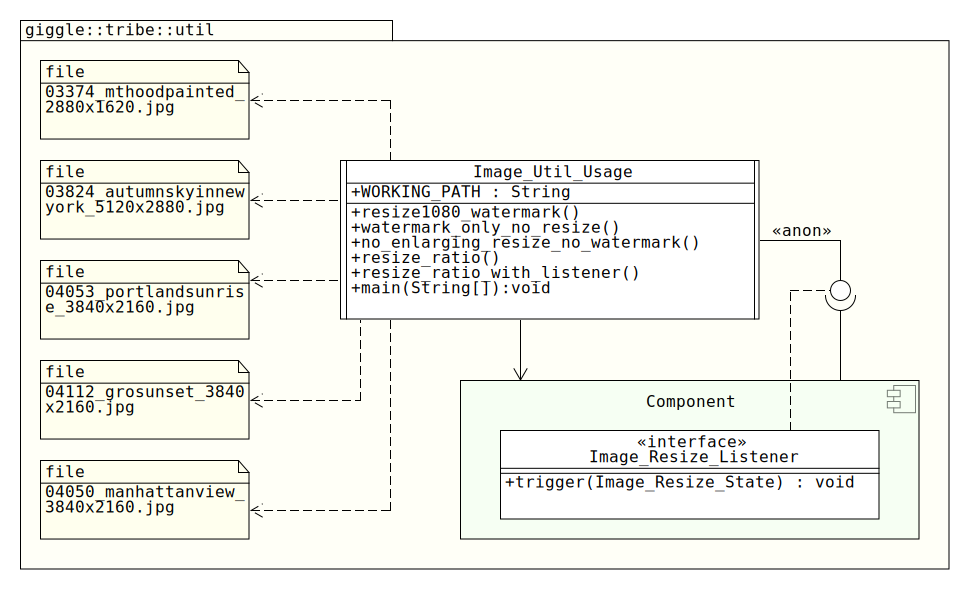

# Giggle Image Lib Usage
This repo contains a simple Eclipse/Ant project for testing [Giggle Image Lib](https://github.com/911992/_Giggle_image_util)

## Revision History
**Initial Release 0.1** (Feb 15, 2020)
Based on Giggle Image Lib V0.1 (20200215)

## Requirements
1. [Giggle Image Lib](https://github.com/911992/_Giggle_image_util) 
2. Java 1.5 or later
3. Java AWT library (not all JRE profiles come with this lib, you may probably need full-profile)

## Class Diagram


## How To Build?
1. **Important:** make sure `WORKING_PATH` in `Image_Util_Usage` has a correct path, by default it's `./` that points out to current path  
2. Build the project either using Ant as `ant build`, or import it to Eclipse and make a build(note, target jar file will be around 50-60 MB because of large embedded images).

### Sample Successful Output On `STDOUT`
```
Giggle Generic Image Util(Java) v0.1(20200215)
Working path: GIGGLE
Resizing to 1080, with watermark example. File: 03374_mthoodpainted_2880x1620.jpg
No resizing, with watermark example. File: 03824_autumnskyinnewyork_5120x2880.jpg
No enlarging on target, with watermark example. File: 04053_portlandsunrise_3840x2160.jpg
Image_Resize_State_IMAGE_IO_READ_BEGIN(0)
Image_Resize_State_IMAGE_FETCH_DIMENSION_BEGIN(1613)
Image_Resize_State_CALCULATING_FINAL_IMAGE_DIMENSION_BEGIN(0)
Image_Resize_State_TARGET_IMAGE_CREATION_BEGIN(0)
Image_Resize_State_IMAGE_RESIZING_BEGIN(0)
Image_Resize_State_TARGET_IMAGE_IO_WRITE_BEGIN(16)
Image_Resize_State_PROCESS_FINISHED(82)
```

## Troubleshooting
### Function `main` throws `ClassNotFoundException`.
Make sure you have added the Giggle Image Lib to the classpath, also you may check [troubleshooting of Giggle Image Lib](https://github.com/911992/_Giggle_image_util#troubleshooting)

### Running `Image_Util_Usage` results status code of 1, and an error message as "Error, please define WORKING_PATH variable as target accessible path for saving sample..."
Make sure you have set the `WORKING_PATH` in `Image_Util_Usage` class

##Resources Contribution
Considering following list of files were used in this project.
* "Mt Hood. Painted" By "Jason Tang" [03374_mthoodpainted_2880x1620.jpg](./src/giggle/tribe/util/03374_mthoodpainted_2880x1620.jpg)  
* "Autumn Sky In New York" By "Woojin Bae" [03824_autumnskyinnewyork_5120x2880.jpg](./src/giggle/tribe/util/03824_autumnskyinnewyork_5120x2880.jpg)  
* "Manhattan View" By "Dionisis Partheniadis" [04050_manhattanview_3840x2160.jpg](./src/giggle/tribe/util/04050_manhattanview_3840x2160.jpg)
* "Portland Sunrise" By "Jarred Decker" [04053_portlandsunrise_3840x2160.jpg](./src/giggle/tribe/util/04053_portlandsunrise_3840x2160.jpg)
* "Gro Sunset" By "Sven Mueller" [04112_grosunset_3840x2160.jpg](./src/giggle/tribe/util/04112_grosunset_3840x2160.jpg)


All images were fetch from interfacelift.com 